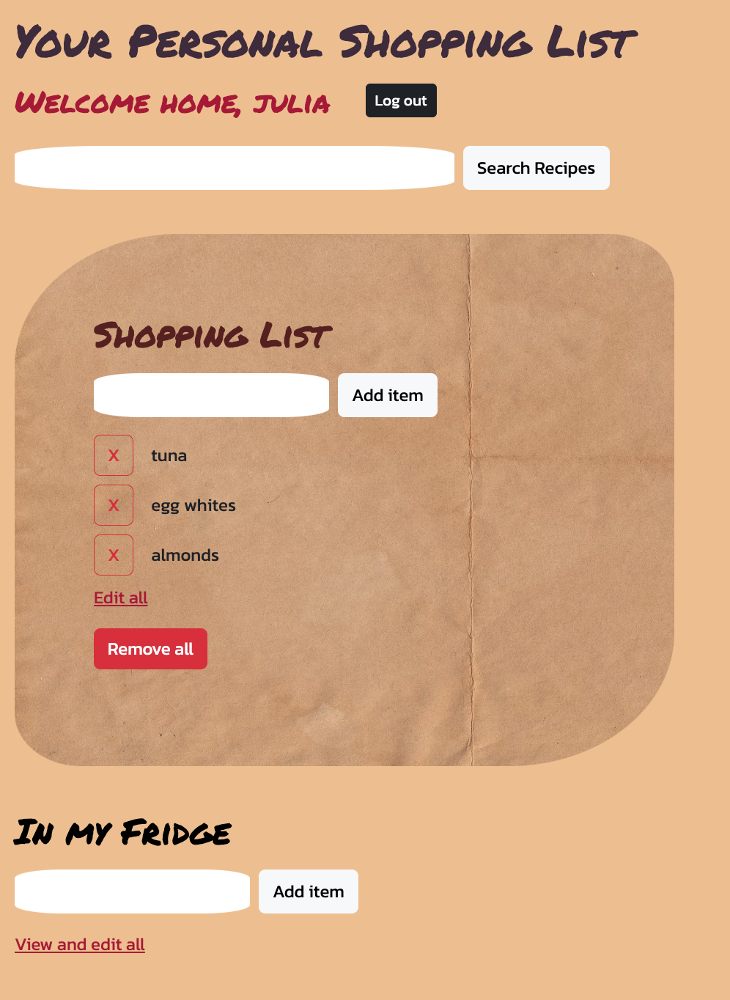
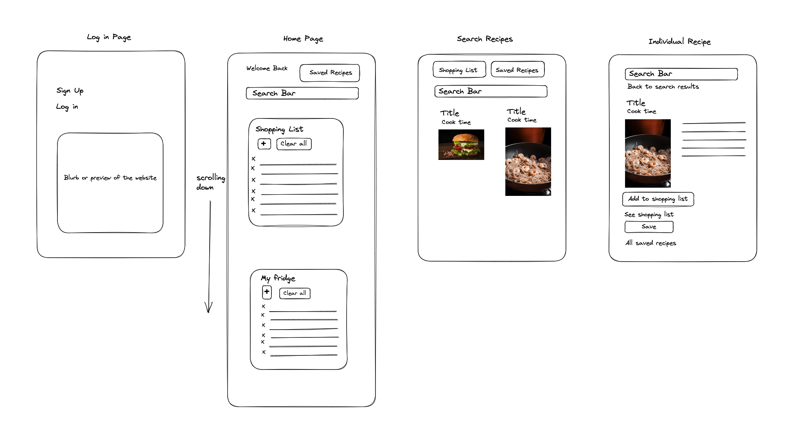
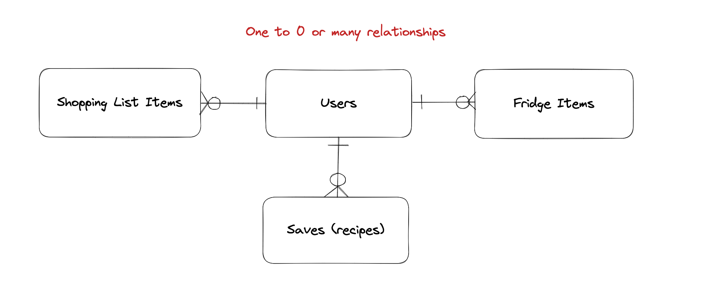

# Shopping List App :shopping_cart:
A shopping list app that allows you to organise your grocery list easier. You can search for recipes, add ingredients to your shopping list from any recipe. You can also add items to your fridge that you already have at home. The shopping list will take them into account for you! 
## :computer: [Click here](https://shopping-list-app-vjul.onrender.com/) to register!
## :page_facing_up: About
**How to use the app:**
1. Sign up to the app.
2. Log in into your personal shopping list.
3. Add ingredients into your Fridge list that you already have at home.
4. You can add new, remove and update your shopping list items as much as you want, as well as your fridge items.
5. Search for recipes to cook for the week.
6. Click on a recipe that you like and tick the ingredients.
7. Press 'Add ingredients to the shopping list' to add them into your personal shopping list.
8. Then take the list to a grocery shop with you! 
9. As you pick up the items from the store you can delete them from your shopping list.
 

## :pencil2: Planning & Problem Solving
As this project had to have more than one page I started my plannig process by drawing up the [wireframes for my app](https://excalidraw.com/#json=HdP2lA1oRzB4YOIHlC9wS,IGXd_V-V7s1t8jYryxiEbA). This then helped me to structure the directories and files inside them in a more organised manner as I knew exactly what the app was goin to require.
 

I also needed to use at least 3 tables so I had to make the app includes them. I wrote them down, made some notes on the columns they will need to have and established types of relationships they will have between each other:
 

Then I dotted down my to-do list for the app making sure I am clear on my priroties.

**Tables and CRUD:**
- Focus first on creating the shopping and fridge lists
- Make the lists interact with each other
- Add CRUD to both lists

**Add the API (as na extra feature):**
- Add search results
- Individual recipe pages
- Ability to add the ingredients from a recipe to the shopping list
- Lastly add the save button (didn't get to this one)

**Add CSS:**
- Pick a color scheme
- Pick fonts
- Set up search results for recipes with grid
- Style the buttons (took longer than I thought - too many buttons :sos:)
- Rearrange buttons and forms

**Deploy Project:**
- Deploy app on Render
- Fix any errors that arise

Seperating my work into sections like above allowed me to focus on one part of the project each day. This startegy helped me to stay focused and prevented me from jumping betweeen the different tasks.

## :rocket: Cool tech
- Coding languages: HTML, CSS, Python.
- Web framework: Flask.
- Database related tech: Postgresql, Psycopg2, CRUD, RESTful routes.
- Code editor: Visual Studio Code.
- Deployment: gunicorn, Render.
- Libraries: requests, Animate.css, Bootstrap(to style the buttons).
- External API: [Sponacular](https://spoonacular.com/food-api).
- Animation: when a page loads the content fades in for a more pleasant user experience (Animate.css).
- All the passwords are securely stored through bcrypt hashing and salthing.

## :scream: Bugs to fix :poop:
- If an item exists in the shopping list and a user adds the same item to their fridge list then for it to be removed from the shopping list the page needs to be reloaded.
- If an item is in the shopping list already, then it cannot be added again. It would be better to improve this => when an exisiting item gets added the shopping list will show "2x" that item. 
- Website is not adjusted for screens of different sizes, e.g. the mobile interface.

## :sob: Lessons learnt
- Do not permanently remove parts of the code before testing the new code, it's better to comment them out where possible or save them in a seperate file.
- Have the confidence that tomorrow I will be able to solve the problems that I had today and let myself rest.

## :white_check_mark: Future features
- Save button for recipes.
- A page with saved recipes.
- Displaying the fridge items on the main screen as a list, so that the user can view them without needing to click on the 'View and edit all' link.
- Add a 'Check all' button on the individual recipe pages to save the user time checking all the items before adding them to the shopping list.
- If an item already exists in the fridge and a user tries to add it to their shopping list display a message ‘Item already exists, are you sure you want to add it?’. This will give the user an option to add an exisiting item to the shopping list.
- Add update all button instead of individual updates for the shopping list and fridge in case a user wants to bulk-update their items.
